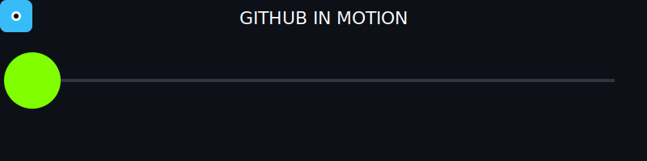

<h1 align="center">Taruni Medishetty</h1>
<h4 align="center">Intelligent Agents • Predictive AI • System Engineering
</h4>

---

  

  
  

  

  

---

## About Me
I am Taruni Medishetty, a Computer Science and Engineering (Data Science) student at Malla Reddy University, Hyderabad.  
I am developing strong proficiency in Python and Machine Learning, with a long-term focus on AI agent development.  
I have hands-on experience building predictive models, admin dashboards, and vendor/client management modules for Medi Constructions.  
My work is driven by scalable system design, structured development, and solving real-world industry problems using data-centric AI.  
I consistently build and ship projects through hackathons and technical competitions, with an emphasis on learning through iteration.

---

## Development Stack

  

---

## Connect With Me

  
  
  

  
  
  

---

  

<picture>
  <source media="(prefers-color-scheme: dark)" srcset="output/pacman-contribution-graph-dark.svg">
  <source media="(prefers-color-scheme: light)" srcset="output/pacman-contribution-graph.svg">
  
</picture>

  

